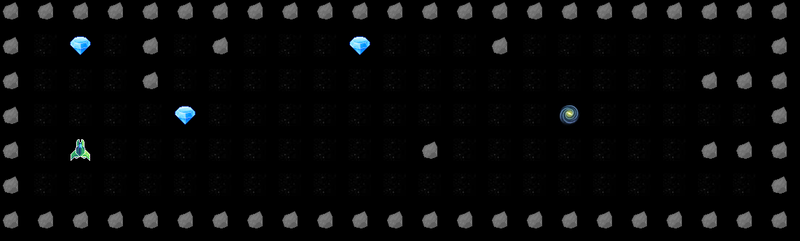

<h1 align="center">so_long</h1>

<p align="center">
  
  
  
</p>

<p align="center">
  A small 2D top-down game written in C with MiniLibX, built as part of the <a href="https://www.42.rio/">42 Rio</a> Common Core.
</p>

<p align="center">
  
  
  
  
</p>

<p align="center">
  
</p>

---

## About

**so_long** is the first graphical project of the 42 curriculum. The goal is to build a tiny tile-based game from scratch: open a window, load sprites, read a map from a file, handle keyboard input and manage memory cleanly, all in plain C.

In this version you pilot a spaceship through a maze. Collect every coin on the map, then reach the exit using as few moves as possible.

## Features

- Tile-based rendering with XPM sprites (50 px grid)
- Ship sprite rotates to face the direction of movement
- Movement with `W` `A` `S` `D` or the arrow keys
- Move counter printed to the terminal on every step
- The exit only opens once every coin has been collected
- Full map validation before the window opens, including a flood-fill check that guarantees every coin and the exit are reachable
- Clean shutdown on `ESC` or the window's close button, freeing all images and memory

## Requirements

- Linux with X11
- `cc`, `make`
- X11 development libraries required by MiniLibX

On Debian/Ubuntu:

```bash
sudo apt-get install gcc make xorg libxext-dev libx11-dev libbsd-dev
```

MiniLibX, libft and ft_printf are already included in the `libraries/` folder, so there is nothing else to download.

## Build

```bash
git clone https://github.com/hadamas/game.git
cd game
make
```

| Command       | Description                                    |
|---------------|------------------------------------------------|
| `make`        | Builds the libraries and the `so_long` binary  |
| `make clean`  | Removes object files                           |
| `make fclean` | Removes object files and the binary            |
| `make re`     | Rebuilds everything from scratch               |

## Usage

Run the game from the repository root (sprites are loaded from `./assets/`), passing a `.ber` map as the only argument:

```bash
./so_long maps/map02.ber
```

### Controls

| Key                | Action      |
|--------------------|-------------|
| `W` / `↑`          | Move up     |
| `S` / `↓`          | Move down   |
| `A` / `←`          | Move left   |
| `D` / `→`          | Move right  |
| `ESC` / close (✕)  | Quit        |

## Maps

Maps are plain-text files with the `.ber` extension, built from five characters:

| Char | Meaning                 | Sprite |
|:----:|-------------------------|:------:|
| `1`  | Wall                    |  |
| `0`  | Empty space             |  |
| `C`  | Collectible (coin)      |  |
| `E`  | Exit                    |  |
| `P`  | Player starting position|  |

Example (`maps/map03.ber`):

```
1111111111111111111
1P00000000000000C01
10C0000000001000001
1000E00000001000001
1000000000000000001
1111111111111111111
```

### Validation rules

A map is accepted only if:

- the file has the `.ber` extension and can be opened
- it contains only the characters `0`, `1`, `C`, `E` and `P`
- it is rectangular (square maps are rejected) and fully enclosed by walls
- it has exactly **one** player, exactly **one** exit and **at least one** collectible
- every collectible and the exit can be reached from the player's starting position

Anything else stops the program with an error message before the window opens:

| Message                           | Cause                                   |
|-----------------------------------|-----------------------------------------|
| `Wrong initialization`            | Wrong number of arguments               |
| `Error: This file is not .ber`    | Invalid file extension                  |
| `Error: Unable to find this map`  | File does not exist or cannot be opened |
| `Error: The .ber file is empty.`  | Empty map file                          |
| `Error: This map is irregular`    | Map breaks one of the rules above       |

Three sample maps are available in `maps/`. To create your own, just add a new `.ber` file that follows the rules.

## Project structure

```
.
├── Makefile
├── assets/              # Sprites (.xpm used by the game, .png originals)
├── maps/                # Sample .ber maps
├── libraries/
│   ├── libft/           # My libft + get_next_line
│   ├── ft_printf/       # My ft_printf
│   └── minilibx-linux/  # 42's graphics library
└── source/
    ├── so_long.c        # Entry point, window setup, key hook
    ├── so_long.h        # Structs, key codes, prototypes
    ├── check_file.c     # Argument and file checks
    ├── init_map.c       # Map reading and loading
    ├── error.c          # Map validation (shape, characters, walls)
    ├── exit_door.c      # Flood fill: checks for a valid path
    ├── draw_map.c       # Sprite loading and map rendering
    ├── move.c           # Player movement and move counter
    └── exit_game.c      # Cleanup and exit
```

## How it works

1. **Argument check** – the program verifies the argument count, the `.ber` extension and that the file exists.
2. **Map loading** – the file is read with `get_next_line`, joined into a single string and split into a 2D array.
3. **Validation** – characters, shape, element counts and surrounding walls are checked. A flood fill then runs on a copy of the map, starting at the player, to confirm that all coins and the exit are reachable.
4. **Rendering** – MiniLibX opens a window sized to the map, loads the XPM sprites and draws each tile.
5. **Game loop** – a key hook handles movement: only the two affected tiles are redrawn, coins are removed from the map as they are collected, and the move count is printed.
6. **Exit** – when the player reaches the exit with no coins left (or quits), all images, the window, the display and the map are freed.

## What I learned

- Working with a graphics library: windows, images and event hooks
- Parsing and validating external input defensively
- Flood fill / recursive path checking
- Organising a C project across multiple files and static libraries with Makefiles
- Tracking ownership of every allocation to exit without leaks

## Author

**Alanis Hadama** (`ahadama-`) – 42 Rio
GitHub: [@hadamas](https://github.com/hadamas)

---

<p align="center"><sub>Developed as part of the 42 curriculum. MiniLibX is distributed under its own license, included in <code>libraries/minilibx-linux</code>.</sub></p>
